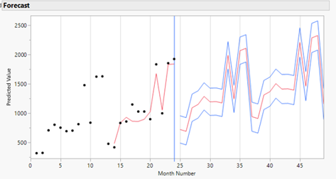

# Insurance Market Strategy Analysis

## Project Overview

This project uses statistical modeling and forecasting to address business decisions for a fictional regional auto insurance company seeking to expand its market while retaining existing customers.

The analysis examines **premium pricing, customer retention, sales lead conversion, and future market demand**, translating statistical results into practical recommendations for pricing, marketing, and workforce planning.

## Business Questions

- Are customer premiums influenced by factors such as gender or customer tenure?
- Are long-term customers receiving competitive rates relative to newer customers?
- Which characteristics are most useful for identifying sales leads likely to purchase insurance?
- How is market demand expected to change over time?
- How should anticipated demand and seasonality affect staffing decisions?

## Analytical Approach

The project combines several statistical techniques:

- **Exploratory Data Analysis** — evaluated customer, premium, and market characteristics.
- **Multiple Linear Regression** — analyzed factors associated with annual insurance premiums.
- **Hypothesis Testing** — evaluated whether selected customer characteristics had statistically significant relationships with premiums.
- **Logistic Regression** — modeled the likelihood that prospective customers would purchase a policy.
- **Model Validation** — evaluated regression assumptions and predictive performance using training and validation data.
- **Time-Series Forecasting** — compared exponential smoothing approaches and modeled future market demand and seasonality.

## Tools & Skills

- R
- JMP
- Multiple Linear Regression
- Logistic Regression
- Hypothesis Testing
- Predictive Modeling
- Model Validation
- Time-Series Forecasting
- Business Analytics
- Data Visualization

## Analysis & Findings

The analysis identified several opportunities for management action:

- Premium modeling identified statistically significant differences associated with customer characteristics, highlighting areas for further pricing review.
- Customer tenure was associated with premium levels, suggesting an opportunity to evaluate retention incentives for established customers.
- Predictive modeling identified customer and vehicle characteristics useful for prioritizing prospective sales leads.
- Market demand showed substantial seasonality, with the final four months of the year accounting for a large share of projected annual activity.
- Forecast results can be used to anticipate periods of increased service demand and support proactive staffing decisions.

### Business Recommendations

The analysis supports several potential actions:

- Review premium structures for inconsistencies and potential pricing adjustments.
- Evaluate loyalty or retention incentives for established customers.
- Use predictive lead scoring to prioritize marketing and sales activity.
- Align staffing plans with projected seasonal demand.
- Continue monitoring pricing and customer data as additional observations become available.

## Project Files

### Full Analysis Report

The complete report includes the executive summary, statistical analysis, model development and validation, forecasts, and business recommendations.

[Download the Insurance Market Strategy Analysis Report](InsuranceMarketReview.pdf)

## Data Sources

The analysis uses publicly available datasets representing insurance customers, sales leads, and automobile sales.

- **Health Insurance Cross-Sell Prediction** — customer demographics, insurance characteristics, and response data.
- **Car Sales Report** — historical automobile sales data used as a proxy for potential auto-insurance market demand.

Source datasets were obtained from Kaggle and used for academic analysis.

## Project Context

This project was completed as part of graduate-level business statistics coursework. The emphasis was on applying statistical methods to realistic business problems and communicating the results as actionable recommendations rather than presenting statistical output alone.
